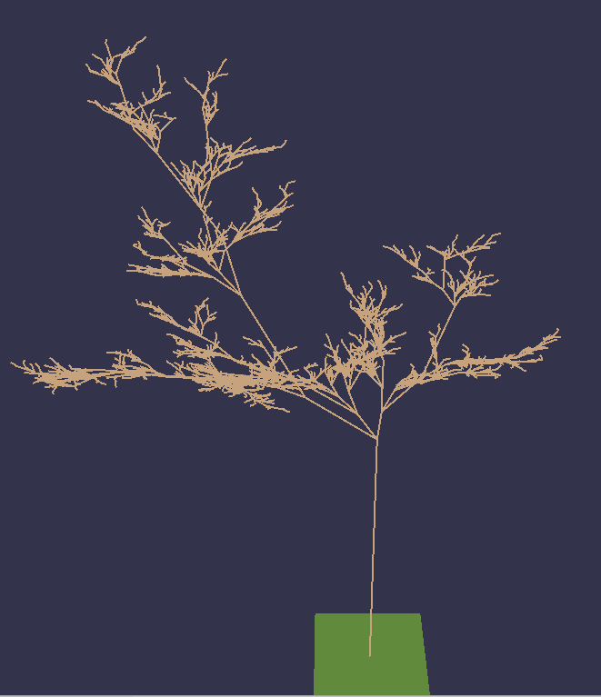
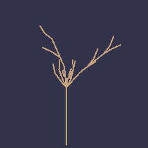
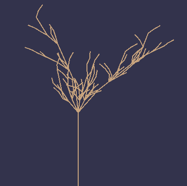
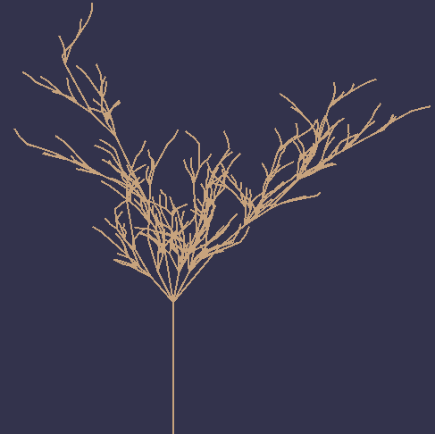
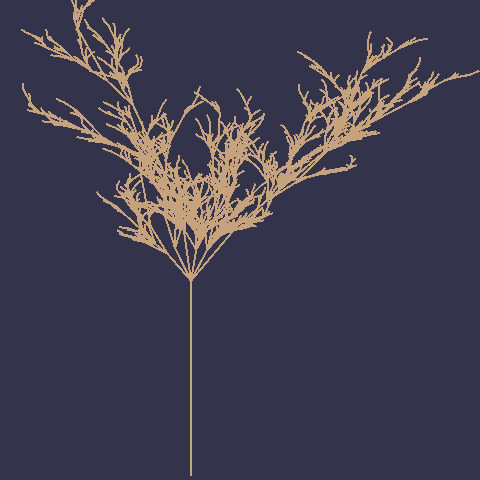

# L-System_Trees
## Generating 3D Models For Trees using L-Systems

This project used OpenGL and a Docker image to run it. 

##What does it do?
This project generates a tree starting with a simple string like: "X".
It then expands the string according to certain rules.
The rules look something like this:  X -> F&+[[X]+X]-F[+FX]+X. 

Finally, it transforms it into a system that closely simulates plant models and their growth.
Like the following:

It can also simulate tree growth by incrementing the Lindenmayer System.
These images show the stages of a single tree as it incremented

<table>
    <tr>
        <td>
          
        </td>
        <td>
          
        </td>
    </tr>
    <tr>
        <td>
        
        </td>
      <td>
        
      </td>
  </tr>
</table>

## Here are the controls for the app:

- W: move camera up  
- S: move camera down  
- A: move camera left  
- D: move camera right  
- Q: rotate scene to the left  
- E: rotate scene to the right  
- Z: zoom camera out  
- X: zoom camera in  
- C: reset camera to original position  
- V: reset camera to downward view  
